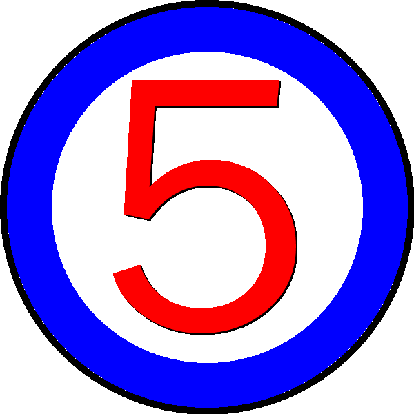
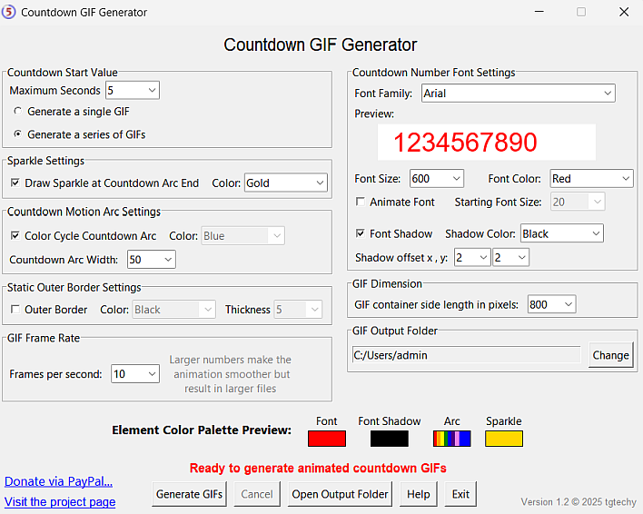

## Animated Countdown GIF Generator

This is a Windows 10 or 11, 64 bit compatible executable program. The program generates highly customizable animated GIFs showing a countdown from a specified number of seconds. The graphics it produces are similar to a clock face with a moving arc that decreases its length over the countdown period. The following GIF shows an example countdown GIF:

Fonts, shadows, colors, borders, arc width, "zooming" text, and an animated sparkle at the end of the arc are all configurable.

The GIFs are transparent so they can be used as overlays on screens, photos, movies, etc.

You may also choose the size of the GIF and the FPS (frames per second) rate. High frames per second generate smoother countdowns but produce larger file sizes and increase generation time.

## Settings Screen

The Maximum Seconds value determines the beginning value for the countdown sequence. For example, if you set the value at 5:

- A single GIF countdown from 5 to 0 will be generated if the "Generate a single GIF" is checked. 
- A series of five GIFs will be generated if the "Generate a series of GIFs" is checked. One GIF will countdown from 5, then another GIF will countdown from 4, etc. This is useful if you have a need for different countdown values dependent on your needs.

The GIFs are stored in the directory of your choice with the filename "Countdown_XX.gif" where XX is the beginning countdown number.

Settings are saved when you exit and reloaded when you start the program again.

The settings file is located in the folder APPDATA\Roaming\CountdownGIFGenerator. For example, if the user is "admin," the folder path and filename is:

`[Drive Letter]:\Users\admin\AppData\Roaming\CountdownGIFGenerator\countdown_gif_generator_settings.json`

If you want to reset all settings to defaults, simply delete the .json file from the directory.

Note that you can choose settings that cause different graphic elements to overlap and/or fall outside the GIF width. If this happens, simply readjust settings to prevent it.

## Installation
From the main repository page, click the "Latest" link in the Releases section on the right hand side of the page. Then click the CountdownGIFGeneratorSetup.exe link to download the setup file. Run the file to install. The setup file is not digitally signed so you will likely get a warning when installing. You may bypass these warnings. The files have been scanned with multiple anti-virus programs and are virus-free. The SHA256 hash value for the file is provided for you to check against the downloaded version for additional security.
