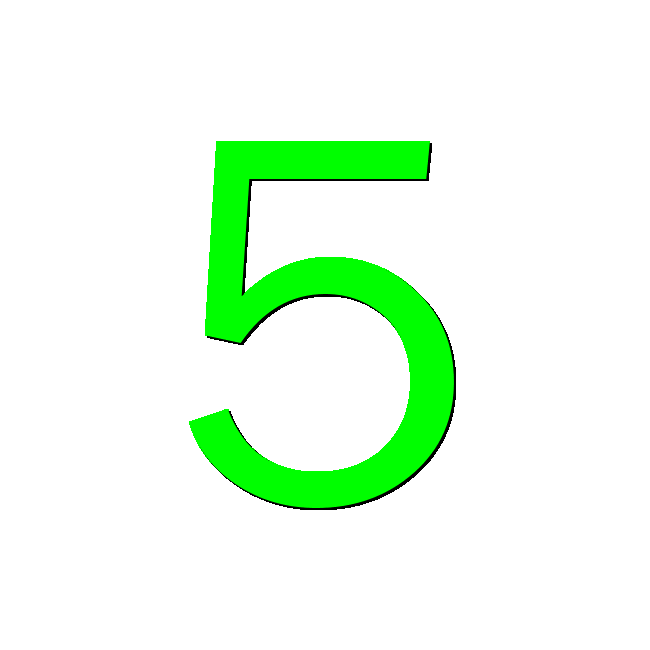

## Animated Countdown GIF Generator

This is a Windows 10/11 program. All core functions are functional in the free version. If you would like to unlock the premium features, a small donation is requested.

The program renders highly customizable transparent animated GIFs showing a countdown from a specified number of seconds. The graphics it produces are similar to a clock face with an optional arc that decreases its length over the countdown period. The following animated GIFs show some example outputs for a 5 second countdown:

  
  
  
  
  

<em>Note: Your browser probably shows the examples looping. The GIFs themselves don't loop by default.</em>

The GIFs are suitable for overlays on photobooth screens, trivia game screens, movies, etc. Transparency allows live backgrounds to show through as the timer counts down. You can also generate GIFs with solid background colors if you prefer. 

Fonts, shadows, colors, borders, arc width, "zooming" text, and an animated sparkle at the end of the arc are all configurable. Many effects can be combined with each other for one-of-a-kind countdowns.

You may choose the GIF dimensions and the FPS (frames per second) rate. High frames per second generate smoother countdowns but produce larger file sizes and increase generation time. 20 FPS is smooth. You can experiment with higher or lower FPS rates to see what works best for you.

## Settings Screens

 

The Maximum Seconds value determines the beginning value for the countdown. For example, if you set the value at 5:

- A single GIF countdown from 5 to 0 will be generated if the "Generate a single GIF" is checked. 
- A series of five GIFs will be generated if the "Generate a series of GIFs" is checked. One GIF will countdown from 5 to 0, then another GIF will countdown from 4 to 0, etc.

The GIFs are stored in the directory of your choice as "Countdown_XX.gif" where XX is the beginning countdown number.

Settings are saved when you exit and reloaded when you start the program. You may also save/load custom settings.

Note that you can choose settings that cause different graphic elements to fall outside the GIF width or clip the font for very large fonts. Sometimes you may like that effect; if not, simply readjust settings to prevent it.

If you want to unlock the premium features, use the "Upgrade" link on the main screen. To simply make a donation to support further development, click here: [Donate via PayPal](https://www.paypal.me/tgtechdevshop)

## Installation
From the main repository page, click the "Latest" link in the Releases section on the right hand side of the page. Then click the CountdownGIFGeneratorSetup.exe link to download the setup file. Run the file to install.

⚠️ **The setup file and the main program are digitally self signed so you may get a warning when installing. You may bypass these warnings.** The reason is getting a signing certificate traced to a Certificate Authority is expensive and complicated for small, individual developers.

**Note: The files have been scanned with multiple anti-virus programs and are virus-free.** Note that the SHA256 hash value for the file is provided in the release notes if you want to check the downloaded setup version against the original to ensure nothing has been tampered with.

To bypass the Windows warning if it appears during setup, click 'More info', then 'Run anyway' as shown below (pics are from Win11, Win10 may be a little different):

