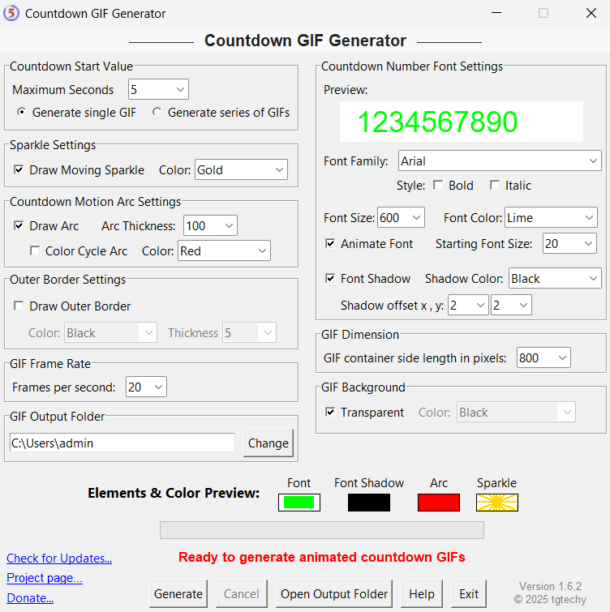

## Animated Countdown GIF Generator

This Windows program generates animated GIFs showing a countdown from a predetermined number of seconds. The graphics it produces are similar to a stopwatch face with moving arc that decreases its length from 100% to 0 for the countdown period. For example, the following graphic shows a snapshot of a GIF shortly after it began counting down from 5 seconds:

Fonts, shadows, colors, border widths, arc width, and an animated sparkle at the end of the arc are all configurable.

The GIFs are transparent so they can be used as overlays on screens, photos, etc.

You may also choose the size of the GIF and the FPS (frames per second) rate. High frames per second generate smoother countdowns, but produce larger file sizes and increase generation time.

Note that the Countdown start value determines the beginning value for the countdown sequence. For example, if you set the value at 5:

- If you only want a single countdown GIF, select the "Generate a single GIF" button. A single GIF counting down from 5 to 0 will be generated.
- Select "Generate a series of GIFs" if you want a series of GIFs counting down from 5, then another GIF counting down from 4, etc, Five GIFs will be generated, one beginning a countdown from 5 to 0, the next from 4 to 0, etc. This is useful if you have a need for different countdown values dependent on your needs.

The GIFs are stored in the directory of your choice with the filename of "Countdown_XX.gif" where XX is the beginning countdown number.

Settings are saved when you exit and reloaded when you begin the program again.

The settings file is located at APPDATA\Roaming\CountdownGIFGenerator. If the user is "admin," the location and filename is:

C:\Users\admin\AppData\Roaming\CountdownGIFGenerator\countdown_gif_generator_settings.json

If you want to reset all settings to defaults, simply delete the .json file.

Note that you can choose settings that cause the graphic elements to overlap and/or fall outside the GIF width. If this happens, simply readjust settings to prevent it.

# Usage Example

The settings in the screenshot result in the GIF below it:

File stored in C:\Users\admin\Countdown_05.gif:

